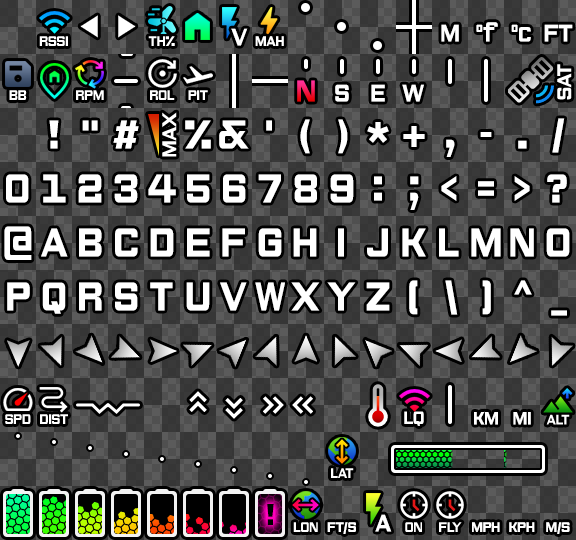

# Neue OSD Font

This is a font set for Caddx/Walksnail [Avatar Digital VTX System](https://caddxfpv.com/collections/walksnail-avatar-system).
Literally converted from [WTF-Neue-OSD](https://github.com/Kw0ngk4n/WTF-Neue-OSD)
Original Typeface based on [The Neue Black](https://www.theleagueofmoveabletype.com/the-neue-black), hence the name.  
Icons mostly based on [Google Material Symbols](https://fonts.google.com/icons).  
Only Betaflight is supported.

Partially referenced on other OSD font sets:  
KNIFA (https://github.com/Knifa/material-osd/releases)  
VICEWIZE (https://github.com/vicewize/vicewizeosdfontset)  
Sneaky FPV (https://sites.google.com/view/sneaky-fpv/home)

## Installation
1. Unzip and put the **font_update.ini and PNG** files into the root of your goggle's SD card.  
2. Perform a **Font Update** in your goggles menu.
3. Send it!

### Notes:
If you have previously installed other font(s) you may need to edit the **font_update.ini** to accommodate new font(s).

## Source  
You should find Photoshop .psd file(s) if you feel the need to mess with this set.  
Created using Photoshop CS6, layer styles, adjustment and smart object layers are heavily used to create visual effects.
720P Version is down-sampled from 1080P version, some glyphs are hand-adjusted to look more accurate.

## License  
IDK... Let's say [CC-BY-SA 4.0](https://creativecommons.org/licenses/by-sa/4.0/).
